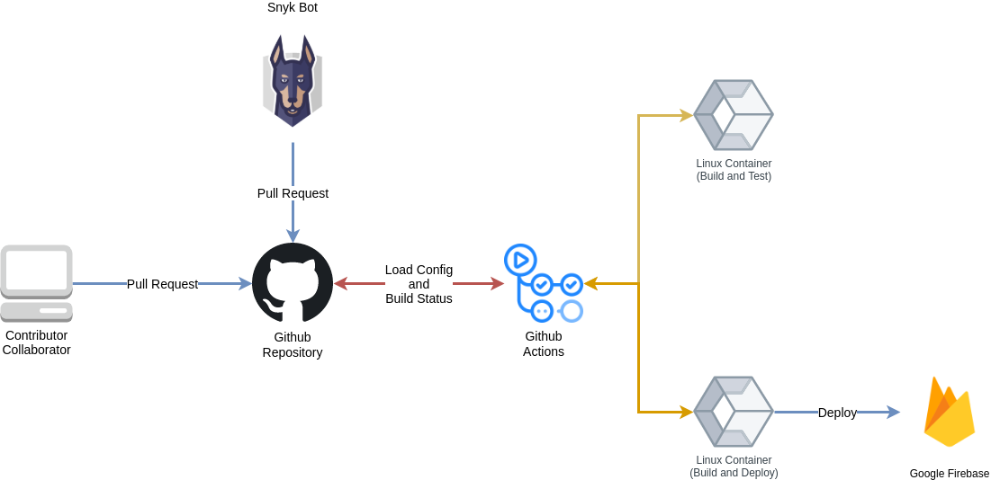
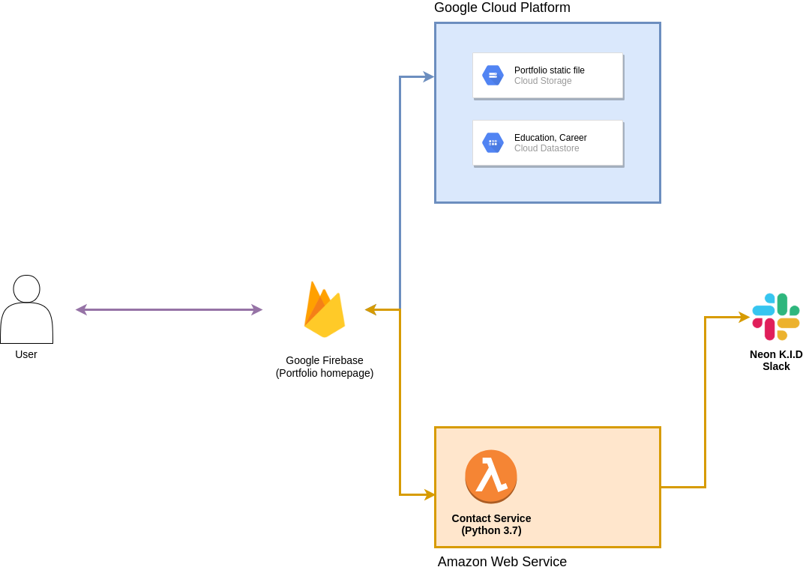

# Portpolio for Neon K.I.D

[](https://github.com/NEONKID/Portpolio-react/actions?workflow=Deploy)

이 레포지터리는 Neon K.I.D의 포트폴리오 레포지터리입니다. 

<br />


## Preview

https://neonkid.xyz


<br />


## Deploy Environment

이 포트폴리오는 Firebase에서 운영되고 있으며, 모든 소스 코드에 대한 수정과 반영은 아래의 흐름대로 이루어집니다.



매주 Snyk 취약점 분석 서비스를 이용해 패키지의 취약점을 확인하고, 개선된 사항에 대해서 자동으로 업데이트 PR을 남기는 구조로 운영하고 있습니다. 또한 모든 소스 코드의 수정은 PR을 통해서 이루어지며, 일정 테스트를 통과하지 않은 경우, 실 서비스에 반영하여 문제가 되지 않도록 파이프라인을 구성하였습니다.


<br />


## Operating Environment



변동이 잦은 경력, 학력 등에 대한 정보는 DB에 저장되어 읽도록 하고, 진행한 프로젝트는 이미지 등 다양한 컨텐츠가 포함되어 있으므로 static html 파일을 별도로 구성하여 읽도록 프로그래밍하였습니다. 홈페이지 내에 있는 연락망은 개인 슬랙과 연동 되어, 언제든 1:1로 문의할 수 있도록 구현하였습니다.


<br />


## Tech

이 홈페이지를 만드는 데 사용한 기술 스택은 아래와 같습니다.

**Front-end**

* Angular 12 + Typescript
* SASS
* Bootstrap 3

**Back-end**

* Python 3.7
* AWS Lambda + API Gateway (Serverless Stack)


<br />


## How to use

```bash
$ yarn start
```

Angular Development Server를 실행하여 테스트해주세요.